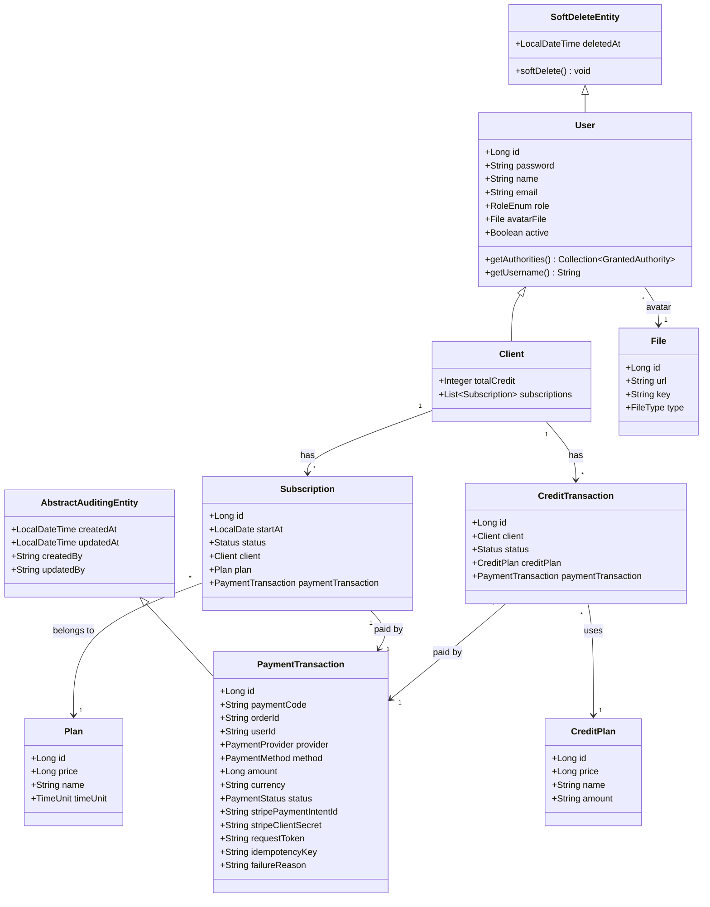

# BÁO CÁO DỰ ÁN AUDIOBOOK
## Sinh viên: Đinh Quốc Đại

---

# 1. DANH SÁCH CHỨC NĂNG ĐƯỢC PHÂN CÔNG

## 1.1. Chức năng xác thực và bảo mật

### Đăng nhập
Triển khai 2 lựa chọn đăng nhập cho người dùng:
- **Đăng nhập bằng tài khoản thường**: Người dùng nhập email và mật khẩu, hệ thống xác thực và trả về JWT token.
- **Đăng nhập bằng tài khoản Google**: Người dùng đăng nhập qua Google OAuth2, hệ thống nhận ID Token từ Google, xác thực và tạo tài khoản nếu chưa có.

### Đăng ký tài khoản
Người dùng đăng ký tài khoản mới bằng email và mật khẩu. Hệ thống gửi OTP qua email để xác thực tài khoản.

### Quên mật khẩu
Người dùng nhập email, hệ thống gửi OTP để xác thực. Sau khi xác thực OTP thành công, người dùng được phép đặt lại mật khẩu mới.

---

## 1.2. Quản lý thông tin cá nhân của người dùng
- Xem thông tin cá nhân (tên, email, ảnh đại diện, số credit, trạng thái hội viên)
- Thay đổi tên hiển thị
- Thay đổi email (yêu cầu xác thực OTP)
- Thay đổi mật khẩu
- Thay đổi ảnh đại diện

---

## 1.3. Quản lý gói hội viên

### Đăng ký gói hội viên
Người dùng xem danh sách các gói hội viên (Plan) có sẵn và chọn gói phù hợp. Thanh toán được thực hiện qua Stripe Payment.

### Hủy gói hội viên
Người dùng hủy đăng ký gói hội viên hiện tại. Trạng thái subscription chuyển sang CANCELLED.

---

## 1.4. Mua thêm credit
Người dùng chọn gói credit (CreditPlan), thanh toán qua Stripe. Sau khi thanh toán thành công, credit được cộng vào tài khoản. Tính năng này chỉ dành cho người dùng đã đăng ký gói hội viên (PREMIUM).

---

# 2. KIẾN TRÚC HỆ THỐNG

## 2.1. Mobile (Flutter)

### Kiến trúc tổng quan
Ứng dụng mobile sử dụng **Flutter** với kiến trúc phân lớp:

```
lib/
├── main.dart                    # Entry point, cấu hình Stripe, routing
└── src/
    ├── auth/                    # Xác thực
    │   ├── models/              # DTO (LoginRequest, RegisterRequest, ...)
    │   ├── screens/             # UI (LoginScreen, RegisterScreen, ...)
    │   └── services/            # API calls (AuthApiService, GoogleAuthService, TokenStorageService)
    ├── profile/                 # Quản lý thông tin cá nhân
    │   └── screens/             # ProfileScreen, ChangeEmailScreen, ...
    ├── payment/                 # Thanh toán & Credit
    │   ├── models/              # CreditPlan, Plan, PaymentModels, ...
    │   ├── screens/             # BuyCreditScreen, PremiumPlanScreen
    │   └── services/            # PaymentApiService
    ├── core/
    │   ├── config/              # AppConfig (API base URL)
    │   └── utils/               # ErrorTranslator
    └── util/
        └── routes.dart          # Định nghĩa routes
```

### Sơ đồ lớp Mobile

```mermaid
classDiagram
    class AuthApiService {
        +String defaultBaseUrl$
        -String baseUrl
        +AuthApiService(baseUrl: String)
        +login(request: LoginRequest) ApiResponse~TokenResponse~
        +loginWithGoogle(idToken: String) ApiResponse~TokenResponse~
        +register(request: RegisterRequest) ApiResponse~void~
        +requestOtp(request: OtpRequest) ApiResponse~void~
        +verifyOtp(request: VerifyOtpRequest) ApiResponse~TokenResponse~
        +forgotPassword(request: OtpRequest) ApiResponse~void~
        +resetPassword(request: ResetPasswordRequest) ApiResponse~void~
        +changePassword(request: ChangePasswordRequest) ApiResponse~void~
        +getCurrentUser(token: String) ApiResponse~UserInfo~
    }

    class TokenStorageService {
        -FlutterSecureStorage _storage
        +saveAuthSession(token: String, userId: String, email: String, role: String) void
        +getToken() String?
        +getUserId() String?
        +getEmail() String?
        +getRole() String?
        +clearSession() void
    }

    class GoogleAuthService {
        +signIn()$ GoogleSignInAccount?
        +getIdToken()$ String?
        +signOut()$ void
    }

    class PaymentApiService {
        +String defaultBaseUrl$
        -String baseUrl
        +PaymentApiService(baseUrl: String)
        +getSubscriptionInfo(token: String) SubscriptionInfoResponse
        +getAllPlans(token: String) List~PlanModel~
        +subscribePlan(token: String, request: UpPremiumRequest) void
        +unsubscribePlan(token: String) void
        +getCreditPlans(token: String) List~CreditPlanModel~
        +createCreditPurchaseIntent(token: String, creditPlanId: int, paymentMethod: String, idempotencyKey: String) CreateStripeIntentResponse
        +confirmCreditPurchase(token: String, paymentId: int) PaymentDetailResponse
        +getPaymentDetail(token: String, paymentId: int) PaymentDetailResponse
    }

    class LoginRequest {
        +String email
        +String password
        +toJson() Map~String,dynamic~
    }

    class RegisterRequest {
        +String email
        +String password
        +String name
        +toJson() Map~String,dynamic~
    }

    class TokenResponse {
        +String token
        +UserInfo? userInfo
        +fromJson(json: Map)$ TokenResponse
    }

    class UserInfo {
        +String? id
        +String? email
        +String? name
        +String? role
        +String? tier
        +int totalCredit
        +String? avatarUrl
        +fromJson(json: Map)$ UserInfo
    }

    class CreditPlanModel {
        +int id
        +String name
        +int price
        +String amount
        +fromJson(json: Map)$ CreditPlanModel
    }

    class PlanModel {
        +int id
        +String name
        +int price
        +String timeUnit
        +fromJson(json: Map)$ PlanModel
    }

    class SubscriptionInfoResponse {
        +String? status
        +String? startAt
        +PlanModel? plan
        +List~PlanModel~ availablePlans
        +fromJson(json: Map)$ SubscriptionInfoResponse
    }

    AuthApiService --> LoginRequest : uses
    AuthApiService --> RegisterRequest : uses
    AuthApiService --> TokenResponse : returns
    AuthApiService --> UserInfo : returns
    PaymentApiService --> CreditPlanModel : returns
    PaymentApiService --> PlanModel : returns
    PaymentApiService --> SubscriptionInfoResponse : returns
```

```mermaid
classDiagram
    class LoginScreen {
        -TextEditingController _emailController
        -TextEditingController _passwordController
        -AuthApiService _authApiService
        -TokenStorageService _tokenStorageService
        -bool _isLoading
        -bool _isGoogleLoading
        +_submitLogin() void
        +_loginWithGoogle() void
        +build(context: BuildContext) Widget
    }

    class RegisterScreen {
        -TextEditingController _nameController
        -TextEditingController _emailController
        -TextEditingController _passwordController
        -AuthApiService _authApiService
        -bool _isLoading
        +_submitRegister() void
        +build(context: BuildContext) Widget
    }

    class ForgotPasswordScreen {
        -TextEditingController _emailController
        -AuthApiService _authApiService
        -bool _isLoading
        +_submitForgotPassword() void
        +build(context: BuildContext) Widget
    }

    class VerifyOtpScreen {
        -TextEditingController _otpController
        -AuthApiService _authApiService
        -TokenStorageService _tokenStorageService
        -bool _isLoading
        +_submitVerifyOtp() void
        +build(context: BuildContext) Widget
    }

    class ProfileScreen {
        -AuthApiService _authApiService
        -TokenStorageService _tokenStorageService
        -UserInfo? _userInfo
        -bool _isLoading
        +_loadProfile() void
        +_onBottomNavTap(index: int) void
        +_logout() void
        +build(context: BuildContext) Widget
    }

    class ChangeEmailScreen {
        -TextEditingController _emailController
        -AuthApiService _authApiService
        -bool _isLoading
        +_submitChangeEmail() void
        +build(context: BuildContext) Widget
    }

    class ChangePasswordScreen {
        -TextEditingController _oldPasswordController
        -TextEditingController _newPasswordController
        -AuthApiService _authApiService
        -bool _isLoading
        +_submitChangePassword() void
        +build(context: BuildContext) Widget
    }

    class PremiumPlanScreen {
        -PaymentApiService _paymentApiService
        -TokenStorageService _tokenStorageService
        -List~PlanModel~ _plans
        -SubscriptionInfoResponse? _subscriptionInfo
        -bool _isLoading
        +_loadData() void
        +_subscribe(planId: int) void
        +_unsubscribe() void
        +build(context: BuildContext) Widget
    }

    class BuyCreditScreen {
        -PaymentApiService _paymentApiService
        -TokenStorageService _tokenStorageService
        -List~CreditPlanModel~ _creditPlans
        -CreditPlanModel? _selectedPlan
        -bool _isLoading
        -bool _isPremium
        -int _currentCreditBalance
        +_seedDefaults() void
        +_payWithStripe(selectedPlan: CreditPlanModel, paymentMethod: String) void
        +_waitForFinalStatus(token: String, paymentId: int) PaymentDetailResponse
        +_confirmPurchase(token: String, paymentId: int) void
        +build(context: BuildContext) Widget
    }

    LoginScreen --> AuthApiService : uses
    LoginScreen --> TokenStorageService : uses
    LoginScreen --> GoogleAuthService : uses
    RegisterScreen --> AuthApiService : uses
    ForgotPasswordScreen --> AuthApiService : uses
    VerifyOtpScreen --> AuthApiService : uses
    VerifyOtpScreen --> TokenStorageService : uses
    ProfileScreen --> AuthApiService : uses
    ProfileScreen --> TokenStorageService : uses
    ChangeEmailScreen --> AuthApiService : uses
    ChangePasswordScreen --> AuthApiService : uses
    PremiumPlanScreen --> PaymentApiService : uses
    PremiumPlanScreen --> TokenStorageService : uses
    BuyCreditScreen --> PaymentApiService : uses
    BuyCreditScreen --> TokenStorageService : uses
    BuyCreditScreen --> AuthApiService : uses
```





---

## 2.2. Backend (Java Spring Boot)

### Kiến trúc tổng quan
Backend sử dụng **Spring Boot** với kiến trúc phân lớp Controller → Service → Repository → Entity.

```
org.backend/
├── auth/           # Xác thực (login, OTP, Google OAuth)
├── client/         # Người dùng, subscription, credit
├── payment/        # Stripe payment integration
├── user/           # Entity User, Admin
├── file/           # Upload file (avatar)
└── common/         # Dùng chung (exception, response, utils)
```

### Sơ đồ lớp Backend - Entity



### Sơ đồ lớp Backend - Controller/Service

```mermaid
classDiagram
    class AuthController {
        -AuthService authService
        +login(loginRequest: LoginRequest) ApiResponse~TokenResponse~
        +loginWithGoogle(request: GoogleLoginRequest) ApiResponse~TokenResponse~
        +logout(token: String) ApiResponse~Void~
        +verifyOtp(req: VerifyOtpRequest) ApiResponse~TokenResponse~
        +activeAccount(token: String) ApiResponse~TokenResponse~
        +requestOtp(req: OtpRequest) ApiResponse~Void~
        +forgotPassword(req: OtpRequest) ApiResponse~Void~
        +resetPassword(token: String, req: ResetPasswordRequest) ApiResponse~Void~
        +changePassword(req: ChangePasswordRequest) ApiResponse~Void~
    }

    class AuthService {
        <<interface>>
        +login(loginRequest: LoginRequest) TokenResponse
        +loginWithGoogle(request: GoogleLoginRequest) TokenResponse
        +verifyOtp(otp: VerifyOtpRequest) TokenResponse
        +activeAccount(token: String) TokenResponse
        +requestOtp(req: OtpRequest) void
        +forgotPassword(req: OtpRequest) void
        +resetPassword(req: ResetPasswordRequest, token: String) void
        +logout(token: String) void
        +changePassword(req: ChangePasswordRequest) void
    }

    class AuthServiceImpl {
        -UserRepository userRepository
        -JwtUtil jwtUtil
        -EmailUtil emailUtil
        -RedisTemplate redisTemplate
        -PasswordEncoder passwordEncoder
        +login(loginRequest: LoginRequest) TokenResponse
        +loginWithGoogle(request: GoogleLoginRequest) TokenResponse
        +verifyOtp(otp: VerifyOtpRequest) TokenResponse
        +activeAccount(token: String) TokenResponse
        +requestOtp(req: OtpRequest) void
        +forgotPassword(req: OtpRequest) void
        +resetPassword(req: ResetPasswordRequest, token: String) void
        +logout(token: String) void
        +changePassword(req: ChangePasswordRequest) void
    }

    class ClientController {
        -ClientService clientService
        +register(req: RegisterRequest) ApiResponse~Void~
        +me() ApiResponse~ClientResponse~
        +changeName(req: ChangeNameRequest) ApiResponse~ClientResponse~
        +preChangeEmail(req: PreChangeEmailRequest) ApiResponse~Void~
        +changeEmail(req: ChangeEmailRequest, token: String) ApiResponse~TokenResponse~
        +changeAvatar(fileDto: FileDto) ApiResponse~FileDto~
    }

    class ClientService {
        <<interface>>
        +register(req: RegisterRequest) void
        +me() ClientResponse
        +changeName(name: String) ClientResponse
        +preChangEmailRequest(newEmail: String) void
        +changeEmail(req: ChangeEmailRequest, token: String) TokenResponse
        +changeAvatar(fileDto: FileDto) FileDto
    }

    class SubscriptionController {
        -SubscriptionService subscriptionService
        +getSubscriptionInfo() ApiResponse~SubscriptionInfoResponse~
        +subscribe(request: UpPremiumRequest) ApiResponse~Void~
        +unsubscribe() ApiResponse~Void~
    }

    class SubscriptionService {
        <<interface>>
        +getSubscriptionInfo() SubscriptionInfoResponse
        +subscribe(request: UpPremiumRequest) void
        +unsubscribe() void
    }

    class CreditPlanController {
        -CreditPlanService creditPlanService
        +getPlans() ApiResponse~List~CreditPlan~~
        +createPurchaseIntent(request: CreateCreditPurchaseIntentRequest) ApiResponse~CreateStripeIntentResponse~
        +confirmPurchase(request: ConfirmCreditPurchaseRequest) ApiResponse~PaymentDetailResponse~
    }

    class CreditPlanService {
        <<interface>>
        +getPlan() List~CreditPlan~
        +createPurchaseIntent(request: CreateCreditPurchaseIntentRequest) CreateStripeIntentResponse
        +confirmPurchase(request: ConfirmCreditPurchaseRequest) PaymentDetailResponse
    }

    class PlanController {
        -PlanService planService
        +getPlans() ApiResponse~List~PlanResponse~~
    }

    class PlanService {
        <<interface>>
        +getAllPlans() List~PlanResponse~
    }

    AuthController --> AuthService : uses
    AuthService <|.. AuthServiceImpl : implements
    ClientController --> ClientService : uses
    SubscriptionController --> SubscriptionService : uses
    CreditPlanController --> CreditPlanService : uses
    PlanController --> PlanService : uses
```



---

# 3. MÃ NGUỒN HỆ THỐNG

## 3.1. Cấu trúc mã nguồn Backend

| Package | Mô tả |
|---------|-------|
| `org.backend.auth` | Xử lý đăng nhập, OTP, Google OAuth, đổi mật khẩu |
| `org.backend.client` | Quản lý thông tin client, subscription, credit |
| `org.backend.payment` | Tích hợp Stripe, xử lý thanh toán |
| `org.backend.user` | Entity User, Admin |
| `org.backend.file` | Upload/quản lý file (avatar) |
| `org.backend.common` | Exception handling, JWT, response wrapper |
| `org.backend.config` | Security config, Redis, S3, Swagger |

## 3.2. Cấu trúc mã nguồn Mobile

| Thư mục | Mô tả |
|---------|-------|
| `lib/src/auth/` | Màn hình và service xác thực |
| `lib/src/profile/` | Màn hình quản lý thông tin cá nhân |
| `lib/src/payment/` | Màn hình mua credit, đăng ký hội viên |
| `lib/src/core/` | Config, utils dùng chung |
| `lib/src/util/routes.dart` | Định nghĩa routes navigation |

---

# 4. HƯỚNG DẪN CÀI ĐẶT

## 4.1. Yêu cầu môi trường

### Backend
| Công cụ | Phiên bản |
|---------|-----------|
| Java | 17 (Amazon Corretto) |
| Maven | 3.8+ |
| Docker & Docker Compose | 24+ |
| PostgreSQL | 15+ |
| Redis | 7+ |

### Mobile
| Công cụ | Phiên bản |
|---------|-----------|
| Flutter | 3.44.0 (stable) |
| Dart | 3.12.0 |
| Android SDK | API 34+ |
| Android Studio | 2024+ |

---

## 4.2. Cài đặt Backend

### Bước 1: Clone repository và chuyển sang nhánh
```bash
git clone <repository-url>
cd AudioBook
git checkout dinhquocdai
```

### Bước 2: Cấu hình biến môi trường
Tạo file `.env` trong thư mục `api/audio-book/`:
```env
DB_HOST=localhost
DB_PORT=5432
DB_NAME=audiobook
DB_USER=postgres
DB_PASSWORD=your_password
REDIS_HOST=localhost
REDIS_PORT=6379
JWT_SECRET=your_jwt_secret
STRIPE_SECRET_KEY=sk_test_...
STRIPE_WEBHOOK_SECRET=whsec_...
AWS_ACCESS_KEY=your_key
AWS_SECRET_KEY=your_secret
AWS_BUCKET=your_bucket
```

### Bước 3: Khởi động database và Redis bằng Docker
```bash
cd api/audio-book
docker-compose up -d
```

### Bước 4: Build và chạy Backend
```bash
cd api/audio-book
mvn clean install -DskipTests
mvn spring-boot:run
```

Backend sẽ chạy tại: `http://localhost:8080`

Swagger UI: `http://localhost:8080/swagger-ui.html`

---

## 4.3. Cài đặt Mobile

### Bước 1: Cài đặt Flutter
```bash
git clone https://github.com/flutter/flutter.git -b stable ~/flutter
export PATH="$PATH:$HOME/flutter/bin"
flutter doctor
```

### Bước 2: Cài đặt dependencies
```bash
cd mobile_client
flutter pub get
```

### Bước 3: Cấu hình API URL
Mặc định app kết nối tới `http://localhost:8080`. Để thay đổi, truyền biến khi build:
```bash
flutter run --dart-define=API_BASE_URL=http://<your-ip>:8080
```

### Bước 4: Cấu hình Stripe
Trong file `lib/main.dart`, thay `STRIPE_PUBLISHABLE_KEY` bằng key thực:
```bash
flutter run --dart-define=STRIPE_PUBLISHABLE_KEY=pk_test_...
```

### Bước 5: Chạy ứng dụng
```bash
# Chạy trên Android emulator
flutter run -d emulator-5554

# Chạy trên thiết bị thực
flutter run -d <device-id>
```

---

## 4.4. Kiểm tra kết nối

Sau khi backend chạy, kiểm tra API:
```bash
# Health check
curl http://localhost:8080/actuator/health

# Test đăng nhập
curl -X POST http://localhost:8080/auth/login \
  -H "Content-Type: application/json" \
  -d '{"email":"test@example.com","password":"123456"}'
```

---

*Báo cáo được tạo tự động từ mã nguồn dự án AudioBook - Nhánh: dinhquocdai*
